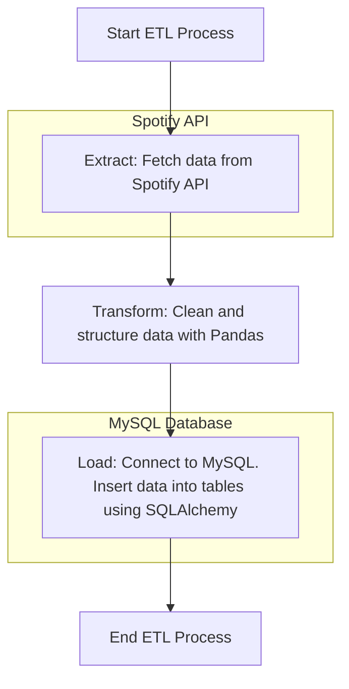
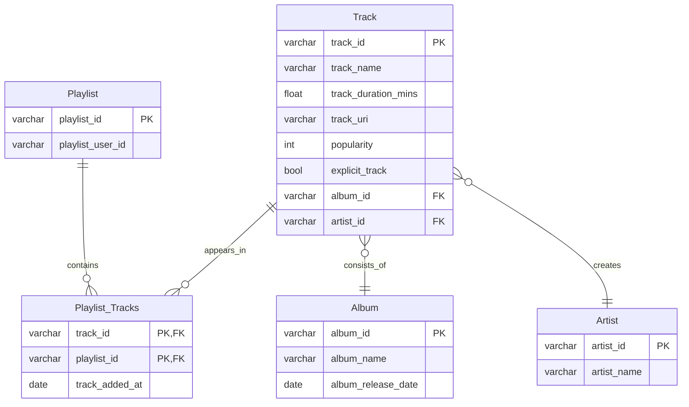

# Spotify Playlist DB

An end-to-end pipeline that pulls track data from Spotify playlists via the Spotify API, loads it into a relational database, and supports in-depth data analysis.

## How This Works

## Database Schema
The database is normalized to 3NF.

